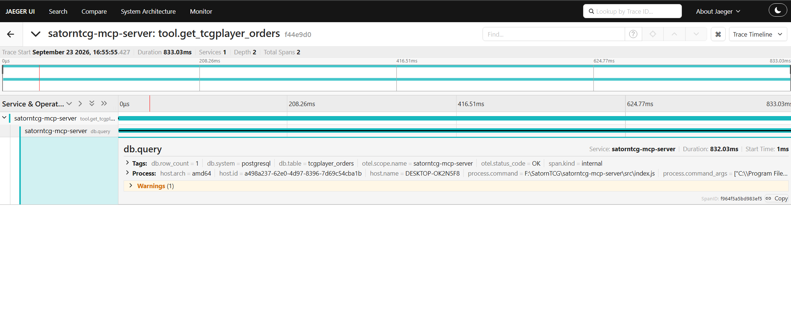

# satorntcg-mcp-server

An [MCP](https://modelcontextprotocol.io) server that exposes live TCG resale/inventory data — pricing, alerts, profit & loss, eBay listings — as tools an LLM client (Claude Desktop, Claude Code, etc.) can call directly. Instead of opening a dashboard, you can just ask: *"what's underpriced right now"* or *"how is the Gothic box performing"* and get an answer grounded in real data.

Built on top of [SatornTCG](https://satorntcg.com), a Sorcery: Contested Realm resale/content operation backed by Supabase/Postgres.

## Why this exists

This started as a resume project to learn MCP server design and observability, and turned into a tool I actually use day to day to query my own inventory and pricing data conversationally instead of clicking through a UI.

## What it exposes

| Tool | Description |
|---|---|
| `get_price_alerts` | Active price alerts, gainers/losers, stale listings, listing-price drift |
| `get_inventory_summary` | Current inventory: quantities owned/listed, latest prices |
| `get_latest_prices` | TCGplayer market price + cost basis lookup by card name |
| `get_box_pnl` | Profit & loss per box (purchase price vs. realized/unrealized pull value) |
| `get_global_pnl` | Overall business P&L across all boxes and listings |
| `get_ebay_listings` | Active or sold eBay listings |

Each tool is a thin wrapper around a Postgres view — see `src/tools/`.

## Architecture

```
Claude Desktop / Claude Code (MCP client)
        │  stdio
        ▼
  src/index.js  ── registers tools, routes tool calls
        │
        ▼
  src/tools/*.js ── one file per domain, each tool = { name, description, inputSchema, handler }
        │
        ▼
  src/supabaseClient.js ── service-role Supabase client
        │
        ▼
  Postgres (Supabase) ── views: v_active_alerts, v_inventory_dashboard,
                          v_latest_prices, v_box_pnl, v_global_pnl,
                          v_ebay_active, v_ebay_sold, v_stale_listings,
                          v_price_gainers_losers, v_listing_price_alerts
```

Every tool call is traced with OpenTelemetry, exported to Jaeger — see [Observability](#observability) below.

## Schema this expects

This server doesn't ship a demo database — it's meant to be pointed at a Postgres/Supabase project with equivalent views. If you're adapting this for your own data, the views above are just `SELECT`s over your own tables; swap the query in each `src/tools/*.js` file to match your schema. Column names referenced directly (e.g. `card_id`, `name`, `tcg_market_price`, `cost_basis`, `dismissed`) are the main thing to line up.

## Setup

```bash
git clone <this-repo>
cd satorntcg-mcp-server
npm install
cp .env.example .env
# fill in SUPABASE_URL and SUPABASE_SERVICE_KEY in .env
npm start
```

The server speaks MCP over stdio, so it's meant to be launched by an MCP client, not run standalone in a terminal for interactive use. To test with **Claude Desktop**, add it to your MCP config (`claude_desktop_config.json`):

```json
{
  "mcpServers": {
    "satorntcg": {
      "command": "node",
      "args": ["/absolute/path/to/satorntcg-mcp-server/src/index.js"]
    }
  }
}
```

Restart Claude Desktop, and the tools above become available in conversation.

## Observability

Every tool call is wrapped in an OpenTelemetry span (`tool.<name>`), with each Supabase query the tool makes nested underneath it as its own `db.query` child span. That split is the point: a slow tool call in Jaeger tells you at a glance whether the time went into the DB round-trip or into everything else the handler did (matching, mapping, duplicate-guard checks, etc.), instead of being one opaque block of latency.

Each `tool.*` span carries:

- `mcp.tool.name`, `mcp.tool.args` — which tool, called with what
- `mcp.tool.row_count` — best-effort row count from the result, when there's an obvious array to count
- `mcp.tool.duration_ms` — total handler wall time
- `mcp.tool.slow` — `true` once `mcp.tool.duration_ms` exceeds `SLOW_TOOL_THRESHOLD_MS` (1000ms, in `src/index.js`) — lets you filter straight to the calls worth looking at without eyeballing durations
- span status `OK`/`ERROR`, with the exception recorded on error

Each `db.query` child span carries `db.table` and, on success, `db.row_count`.

Traces export over OTLP/HTTP to `OTEL_EXPORTER_OTLP_ENDPOINT` (defaults to `http://localhost:4318/v1/traces`, i.e. a local collector/Jaeger — see `.env.example`). Spans are flushed on shutdown (`SIGTERM`/`SIGINT`), so a normal Claude Desktop restart doesn't lose the last few tool calls; see `src/tracing.js` for the shutdown handling and the reasoning behind its timeout.

### Running Jaeger locally

Jaeger's all-in-one image accepts OTLP/HTTP on the default port this server already exports to, so no extra config is needed:

```bash
docker run -d --name jaeger \
  -p 16686:16686 \
  -p 4318:4318 \
  jaegertracing/all-in-one:latest
```

Then start the server as usual (`npm start`, launched by Claude Desktop or run directly) and make a few tool calls. Open the Jaeger UI at [http://localhost:16686](http://localhost:16686), pick **satorntcg-mcp-server** from the Service dropdown, and click Find Traces.



## Security note

`SUPABASE_SERVICE_KEY` is the elevated service-role key, not the public anon key. This is safe here because the server only ever runs as a local process launched by a trusted MCP client (never in a browser bundle) — the same reasoning as using a service role key inside a Supabase Edge Function. Never commit `.env`; only `.env.example` (placeholder values) is tracked.

## Roadmap

- [ ] `suggest_listing` tool — draft an eBay listing from inventory + pricing data
- [ ] HTTP/SSE transport for remote access, alongside the local stdio transport
- [ ] Export OTel traces to a hosted backend (Honeycomb/Grafana) for a demo, in addition to local Jaeger

## License

MIT — see [LICENSE](./LICENSE).
